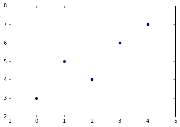
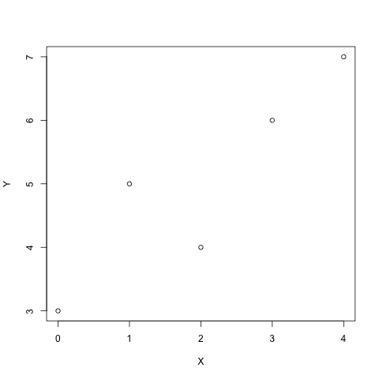
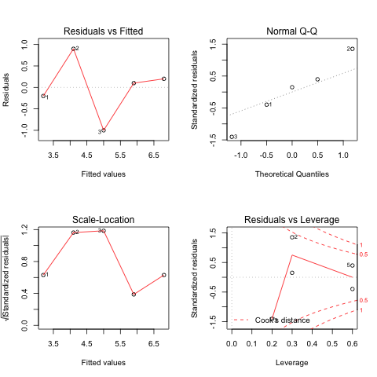
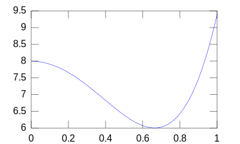
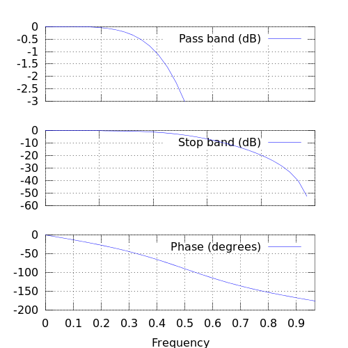
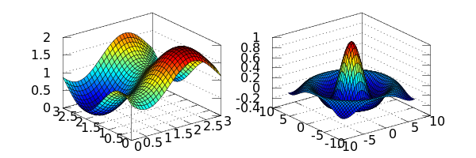

# IPython的魔法符号－Magics
#### [openthings@163.com](http://my.oschina.net/u/2306127/blog?catalog=2527511)

### 最新的Jupyter Notebook可以混合执行Shell、Python以及Ruby、R等代码！
这一功能将解释型语言的特点发挥到了极致，从而打破了传统语言`"运行时"`的边界。

**IPython是一个非常好用Python控制台，极大地扩展了Python的能力。**  
因为它不仅是一种语言的运行环境，而且是一个高效率的分析工具。  
* 之前任何语言和IDE都是相互独立的，导致工作时需要在不同的系统间切换和拷贝／粘贴数据。
* Magic操作符可以在HTML页面中输入shell脚本以及Ruby等其它语言并混合执行，极大地提升了传统的“控制台”的生产效率。
* Magics是一个单行的标签式“命令行”系统，指示后续的代码将如何、以及被何种解释器去处理。
* Magisc与传统的shell脚本几乎没有什么区别，但是可以将多种指令混合在一起。

Magics 主要有两种语法:

* Line magics: 以 `%` 字符开始，该行后面都为指令代码，参数用空格隔开，不需要加引号。
* Cell magics: 使用两个百分号 (`%%`)开始, 后面的整个单元（Cell）都是指令代码。  
注意，`%%`魔法操作符只在Cell的第一行使用，而且不能嵌套、重复（一个Cell只有一个）。极个别的情况，可以堆叠，但是只用于个别情况。

#### 输入 [`%lsmagic`] 可以获得Magic操作符的列表。
如下所示（在Jupyter Notebook环境下，按[`shift+enter`]可以运行。）：


```python
%lsmagic
```

** 缺省情况下，`Automagic`开关打开，不需要输入`%`符号，将会自动识别。**  
注意，这有可能与其它的操作引起冲突，需要注意避免。如果有混淆情况，加上`%`符号即可。

下面显示运行一段代码所消耗的时间。


```python
time print("hi")
```

    hi
    CPU times: user 0 ns, sys: 0 ns, total: 0 ns
    Wall time: 47.9 µs


```python
%time
```

    CPU times: user 0 ns, sys: 0 ns, total: 0 ns
    Wall time: 4.77 µs


#### 执行Shell脚本。


```python
ls -l -h
```

    总用量 340K
    -rw-rw-r-- 1 supermap supermap 266K  4月 29 09:29 jupyter_magics.ipynb
    -rw-rw-r-- 1 supermap supermap  58K  4月 27 12:38 pandas_quickstart.ipynb
    -rw-rw-r-- 1 supermap supermap  12K  4月 27 12:28 pystart_databasic.ipynb


```python
!ls -l -h
```

    总用量 340K
    -rw-rw-r-- 1 supermap supermap 266K  4月 29 09:29 jupyter_magics.ipynb
    -rw-rw-r-- 1 supermap supermap  58K  4月 27 12:38 pandas_quickstart.ipynb
    -rw-rw-r-- 1 supermap supermap  12K  4月 27 12:28 pystart_databasic.ipynb


```python
files = !ls -l -h
files
```


    ['总用量 348K',
     '-rw-rw-r-- 1 supermap supermap 276K  4月 29 09:31 jupyter_magics.ipynb',
     '-rw-rw-r-- 1 supermap supermap  58K  4月 27 12:38 pandas_quickstart.ipynb',
     '-rw-rw-r-- 1 supermap supermap  12K  4月 27 12:28 pystart_databasic.ipynb']


#### 执行多行shell脚本。


```python
%%!
ls -l
pwd
who
```


    ['总用量 344',
     '-rw-rw-r-- 1 supermap supermap 274868  4月 29 09:33 jupyter_magics.ipynb',
     '-rw-rw-r-- 1 supermap supermap  59280  4月 27 12:38 pandas_quickstart.ipynb',
     '-rw-rw-r-- 1 supermap supermap  11528  4月 27 12:28 pystart_databasic.ipynb',
     '/home/supermap/GISpark/git_notebook/pystart',
     'supermap :0           2016-04-28 20:39 (:0)',
     'supermap pts/0        2016-04-28 21:50 (:0)',
     'supermap pts/6        2016-04-28 22:22 (:0)']


### 下面开始体验一下魔法操作符的威力。

载入matplotlib和numpy，后面的数值计算和绘图将会使用。


```python
%matplotlib inline
import numpy as np
import matplotlib.pyplot as plt
```

## <!--====--> cell magics的简单例子

#### `%timeit`  魔法，计量代码的执行时间, 适用于单行和cell:


```python
%timeit np.linalg.eigvals(np.random.rand(100,100))
```

    The slowest run took 8.96 times longer than the fastest. This could mean that an intermediate result is being cached.
    100 loops, best of 3: 5.82 ms per loop


```python
%%timeit a = np.random.rand(100, 100)
np.linalg.eigvals(a)
```

    100 loops, best of 3: 6.07 ms per loop


####  `%%capture`  魔法，用于捕获stdout/err, 可以直接显示，也可以存到变量里备用:


```python
%%capture capt
from __future__ import print_function
import sys
print('Hello stdout')
print('and stderr', file=sys.stderr)
```


```python
capt.stdout, capt.stderr
```


    ('Hello stdout\n', 'and stderr\n')


```python
capt.show()
```

    Hello stdout


    and stderr


####  `%%writefile`  魔法，将后续的语句写入文件中:


```python
%%writefile foo.py
print('Hello world')
```

    Writing foo.py


```python
%run foo
```

    Hello world


## <!--====--> Magics 运行其它的解释器。

##### IPython 有一个 `%%script` 魔法操作符, 可以在一个子进程中运行其它语言的解释器，包括: bash, ruby, perl, zsh, R, 等等.

执行时从stdin取得输入，就像你自己在键入一样。

#### 直接在`%%script` 行后传入指令即可使用。
后续的cell中的内容将按照指示符运行，子进程的信息通过stdout/err捕获和显示。


```python
%%script python
import sys
print('hello from Python %s' % sys.version)
```

    hello from Python 3.5.1 |Anaconda 4.0.0 (64-bit)| (default, Dec  7 2015, 11:16:01) 
    [GCC 4.4.7 20120313 (Red Hat 4.4.7-1)]


```python
%%script python3
import sys
print('hello from Python: %s' % sys.version)
```

    hello from Python: 3.5.1 |Anaconda 4.0.0 (64-bit)| (default, Dec  7 2015, 11:16:01) 
    [GCC 4.4.7 20120313 (Red Hat 4.4.7-1)]


IPython对通用的解释器创建了别名，可以直接使用, 譬如：bash, ruby, perl, etc.  
**等价于这个操作符： `%%script <name>` **


```python
%%ruby
puts "Hello from Ruby #{RUBY_VERSION}"
```

    Hello from Ruby 2.1.5


```python
%%bash
echo "hello from $BASH"
```

    hello from /bin/bash


## 高级练习: 写一个自己的脚本文件。

写一个脚本文件，名为 `lnum.py`, 然后执行：


```python
%%writefile ./lnum.py
print('my first line.')
print("my second line.")
print("Finished.")
```

    Writing ./lnum.py


```python
%%script python ./lnum.py
#
```

    my first line.
    my second line.
    Finished.


## 捕获输出。

可以直接从子进程中捕获stdout/err到Python变量中, 替代直接进入stdout/err。


```python
%%bash
echo "hi, stdout"
echo "hello, stderr" >&2
```

    hi, stdout


    hello, stderr


```python
%%bash --out output --err error
echo "hi, stdout"
echo "hello, stderr" >&2
```

可以直接访问变量名了。


```python
print(error)
print(output)
```

    hello, stderr
    
    hi, stdout
    


## 后台运行 Scripts

只需添加 **`--bg`** ，即可让脚本在后台运行。  
在此情况下, 输出将被丢弃，除非使用 `--out/err` 捕获输出。


```python
%%ruby --bg --out ruby_lines
for n in 1...10
    sleep 1
    puts "line #{n}"
    STDOUT.flush
end
```

    Starting job # 2 in a separate thread.


#### 当后台线程保存输出时，有一个stdout/err *pipes*, 而不是输出的文本形式。


```python
ruby_lines
```


    <_io.BufferedReader name=52>


```python
print(ruby_lines.read())
```

    b'line 1\nline 2\nline 3\nline 4\nline 5\nline 6\nline 7\nline 8\nline 9\n'


# Cython Magic 函数扩展

## 载入 extension

IPtyhon 包含 `cythonmagic` extension，提供了几个与Cython代码工作的魔法函数。使用 `%load_ext` 载入，如下:


```python
%load_ext cythonmagic
```

    /home/supermap/anaconda3/envs/GISpark/lib/python3.5/site-packages/IPython/extensions/cythonmagic.py:21: UserWarning: The Cython magic has been moved to the Cython package
      warnings.warn("""The Cython magic has been moved to the Cython package""")


** `%%cython_pyximport`** magic函数允许你在Cell中使用任意的Cython代码。Cython代码被写入`.pyx` 文件，保存在当前工作目录，然后使用`pyximport` 引用进来。需要指定一个模块的名称，所有的符号将被自动import。


```python
%%cython_pyximport foo
def f(x):
    return 4.0*x
```

    ERROR: Cell magic `%%cython_pyximport` not found.


```python
f(10)
```


    40.0


## The %cython magic

`%cython` magic类似于 `%%cython_pyximport` magic, 但不需要指定一个模块名称. `%%cython` magic 使用 `~/.cython/magic`目录中的临时文件来管理模块，所有符号会被自动引用。

下面是一个使用Cython的例子，Black-Scholes options pricing algorithm:


```python
%%cython
cimport cython
from libc.math cimport exp, sqrt, pow, log, erf

@cython.cdivision(True)
cdef double std_norm_cdf(double x) nogil:
    return 0.5*(1+erf(x/sqrt(2.0)))

@cython.cdivision(True)
def black_scholes(double s, double k, double t, double v,
                 double rf, double div, double cp):
    """Price an option using the Black-Scholes model.
    
    s : initial stock price
    k : strike price
    t : expiration time
    v : volatility
    rf : risk-free rate
    div : dividend
    cp : +1/-1 for call/put
    """
    cdef double d1, d2, optprice
    with nogil:
        d1 = (log(s/k)+(rf-div+0.5*pow(v,2))*t)/(v*sqrt(t))
        d2 = d1 - v*sqrt(t)
        optprice = cp*s*exp(-div*t)*std_norm_cdf(cp*d1) - \
            cp*k*exp(-rf*t)*std_norm_cdf(cp*d2)
    return optprice
```

    ERROR: Cell magic `%%cython` not found.


```python
black_scholes(100.0, 100.0, 1.0, 0.3, 0.03, 0.0, -1)
```


    ---------------------------------------------------------------------------

    NameError                                 Traceback (most recent call last)

    <ipython-input-40-ae31cbfa5fba> in <module>()
    ----> 1 black_scholes(100.0, 100.0, 1.0, 0.3, 0.03, 0.0, -1)
    

    NameError: name 'black_scholes' is not defined


#### 测量一下运行时间。


```python
#%timeit black_scholes(100.0, 100.0, 1.0, 0.3, 0.03, 0.0, -1)
```

Cython 允许使用额外的库与你的扩展进行链接，采用 `-l` 选项 (或者 `--lib`)。 注意，该选项可以使用多次，libraries, such as `-lm -llib2 --lib lib3`.  这里是使用 system math library的例子:


```python
%%cython -lm
from libc.math cimport sin
print 'sin(1)=', sin(1)
```

    sin(1)= 0.841470984808


同样，可以使用 `-I/--include` 来指定包含头文件的目录, 以及使用 `-c/--compile-args` 编译选项，以及 `extra_compile_args` of the distutils `Extension` class.  请参考 [the Cython docs on C library usage](http://docs.cython.org/src/tutorial/clibraries.html) 获得更详细的说明。

# Rmagic 函数扩展

IPython 通过 `rmagic` 扩展来调用R模块，是通过rpy2来实现的(安装：`conda install rpy2`)。   
rpy2的文档：http://rpy2.readthedocs.io/en/version_2.7.x/
#### 首先使用 `%load_ext` 载入该模块:
**注意：新的rpy2已改动，不能运行**。参考：http://rpy2.readthedocs.io/en/version_2.7.x/interactive.html?highlight=rmagic


```python
%reload_ext rmagic
```

    /home/supermap/anaconda3/envs/GISpark/lib/python3.5/site-packages/IPython/extensions/rmagic.py:11: UserWarning: The rmagic extension in IPython has moved to `rpy2.ipython`, please see `rpy2` documentation.
      warnings.warn("The rmagic extension in IPython has moved to "


典型的用法是使用R来计算numpy的Array的统计指标。我们试一下简单线性模型，输出scatterplot。


```python
%matplotlib inline
import numpy as np
import matplotlib.pyplot as plt
```


```python
X = np.array([0,1,2,3,4])
Y = np.array([3,5,4,6,7])
plt.scatter(X, Y)
```


    <matplotlib.collections.PathCollection at 0x7f9760cdd208>





首先把变量赋给 R, 拟合模型并返回结果。 %Rpush 拷贝 rpy2中的变量. %R 对 rpy2 中的字符串求值，然后返回结果。在这里是线性模型的协方差－coefficients。


```python
%Rpush X Y
%R lm(Y~X)$coef
```

    ERROR: Line magic function `%Rpush` not found.
    ERROR: Line magic function `%R` not found.


 %R可以返回多个值。


```python
%R resid(lm(Y~X)); coef(lm(X~Y))
```

    ERROR: Line magic function `%R` not found.


可以将 %R 结果传回 python objects. 返回值是一个“；”隔开的多行表达式，*coef(lm(X~Y))*.

拉取R的其它变量, 采用 %Rpull 和 %Rget. 在 R code 执行后，在 rpy2 namespace 有变量需要获取。  
主要区别是：
 (%Rget)返回值, 而(%Rpull)从 self.shell.user_ns 拉取。想象一下，我们计算得到变量 "a" 在rpy2's namespace. 使用 %R magic, 我们得到结果并存储到 b。可以从 user_ns 使用 %Rpull得到。返回的是同一个数据。


```python
b = %R a=resid(lm(Y~X))
%Rpull a
print(a)
assert id(b.data) == id(a.data)
%R -o a
```

    [-0.2  0.9 -1.   0.1  0.2]


## Plotting and capturing output

R的控制台stdout()被ipython捕获。


```python
from __future__ import print_function
v1 = %R plot(X,Y); print(summary(lm(Y~X))); vv=mean(X)*mean(Y)
print('v1 is:', v1)
v2 = %R mean(X)*mean(Y)
print('v2 is:', v2)
```


    
    Call:
    lm(formula = Y ~ X)
    
    Residuals:
       1    2    3    4    5 
    -0.2  0.9 -1.0  0.1  0.2 
    
    Coefficients:
                Estimate Std. Error t value Pr(>|t|)  
    (Intercept)   3.2000     0.6164   5.191   0.0139 *
    X             0.9000     0.2517   3.576   0.0374 *
    ---
    Signif. codes:  0 ‘***’ 0.001 ‘**’ 0.01 ‘*’ 0.05 ‘.’ 0.1 ‘ ’ 1
    
    Residual standard error: 0.7958 on 3 degrees of freedom
    Multiple R-squared:   0.81,	Adjusted R-squared:  0.7467 
    F-statistic: 12.79 on 1 and 3 DF,  p-value: 0.03739
    





    v1 is: [ 10.]
    v2 is: [ 10.]


## Cell 级别的 magic

我们希望用R在cell级别。而且numpy最好不要转换，参考R: rnumpy ( http://bitbucket.org/njs/rnumpy/wiki/API ) 。


```python
%%R -i X,Y -o XYcoef
XYlm = lm(Y~X)
XYcoef = coef(XYlm)
print(summary(XYlm))
par(mfrow=c(2,2))
plot(XYlm)
```


    
    Call:
    lm(formula = Y ~ X)
    
    Residuals:
       1    2    3    4    5 
    -0.2  0.9 -1.0  0.1  0.2 
    
    Coefficients:
                Estimate Std. Error t value Pr(>|t|)  
    (Intercept)   3.2000     0.6164   5.191   0.0139 *
    X             0.9000     0.2517   3.576   0.0374 *
    ---
    Signif. codes:  0 ‘***’ 0.001 ‘**’ 0.01 ‘*’ 0.05 ‘.’ 0.1 ‘ ’ 1
    
    Residual standard error: 0.7958 on 3 degrees of freedom
    Multiple R-squared:   0.81,	Adjusted R-squared:  0.7467 
    F-statistic: 12.79 on 1 and 3 DF,  p-value: 0.03739
    





# octavemagic: Octave inside IPython

**`octavemagic`** 提供与Octave交互的能力。依赖 `oct2py` 和 `h5py` 软件包。  
载入扩展包:
%load_ext octavemagic
## 概览

载入这个扩展包，启用了三个magic functions: `%octave`, `%octave_push`, 和 `%octave_pull`。  
第一个执行一行或多行Octave, 后面两个执行 Octave 和 Python 的变量交换。


```python
x = %octave [1 2; 3 4];
x
```


    array([[ 1.,  2.],
           [ 3.,  4.]])


```python
a = [1, 2, 3]

%octave_push a
%octave a = a * 2;
%octave_pull a
a
```


    array([[2, 4, 6]])


**`%%octave`** : 多行 Octave 被执行。但与单行不同, 没有值被返回, 我们使用`-i` 和 `-o` 指定输入和输出变量。


```python
%%octave -i x -o y
y = x + 3;
```


```python
y
```


    array([[ 4.,  5.],
           [ 6.,  7.]])


## Plotting

Plot输出自动被捕获和显示，使用 `-f` 参数选择输出的格式 (目前支持 `png` 和 `svg`)。


```python
%%octave -f svg

p = [12 -2.5 -8 -0.1 8];
x = 0:0.01:1;

polyout(p, 'x')
plot(x, polyval(p, x));
```


    12*x^4 - 2.5*x^3 - 8*x^2 - 0.1*x^1 + 8





使用 `-s` 参数调整大小:


```python
%%octave -s 500,500

# butterworth filter, order 2, cutoff pi/2 radians
b = [0.292893218813452  0.585786437626905  0.292893218813452];
a = [1  0  0.171572875253810];
freqz(b, a, 32);
```





```python
%%octave -s 600,200 -f png

subplot(121);
[x, y] = meshgrid(0:0.1:3);
r = sin(x - 0.5).^2 + cos(y - 0.5).^2;
surf(x, y, r);

subplot(122);
sombrero()
```




