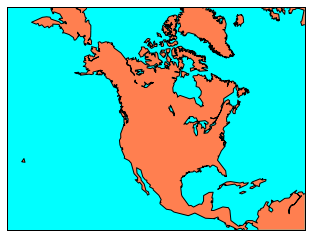
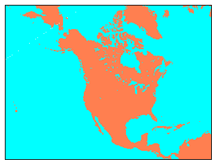
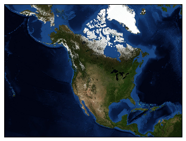
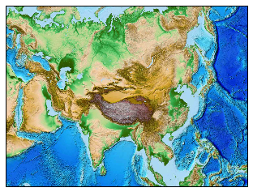

# Matplotlib的Basemap包使用教程。
#### [openthings@163.com](http://my.oschina.net/u/2306127/blog?catalog=2527511)

>安装：conda install basemap

参考：http://matplotlib.org/basemap/users/geography.html

<font color="blue"><b>Basemap</b></font> 包含GSSH 海岸数据集, 像GMT中的河流, 州和国家边界一样。方法包括:

*    drawcoastlines(): 绘制海岸线。
*    fillcontinents(): color the interior of continents (by filling the coastline polygons). Unfortunately, the fillcontinents method doesn’t always do the right thing. Matplotlib always tries to fill the inside of a polygon. Under certain situations, what is the inside of a coastline polygon can be ambiguous, and the outside may be filled instead of the inside. In these situations, the recommended workaround is to use the drawlsmask() method to overlay an image with different colors specified for land and water regions (see below).
*    drawcountries(): draw country boundaries.
*    drawstates(): draw state boundaries in North America.
*    drawrivers(): draw rivers.

Instead of drawing coastlines and political boundaries, an image can be used as a map background. Basemap provides several options for this:

*    drawlsmask(): draw a high-resolution land-sea mask as an image, with land and ocean colors specified. The land-sea mask is derived from the GSHHS coastline data, and there are several coastline options and pixel sizes to choose from.
*    bluemarble(): draw a NASA Blue Marble image as a map background.
*    shadedrelief(): draw a shaded relief image as a map background.
*    etopo(): draw an etopo relief image as map background.
*    warpimage(): use an abitrary image as a map background. The image must be global, covering the world in lat/lon coordinates from the international dateline eastward and the South Pole northward.

Here are examples of the various ways to draw a map background.

下面这个指令指示将绘图结果放到当前页面上，否则会在源服务器上显示窗口，导致页面挂起，而且没有任何显示。


```python
%matplotlib inline
```

Draw coastlines, filling ocean and land areas.


```python
from mpl_toolkits.basemap import Basemap
import matplotlib.pyplot as plt

# setup Lambert Conformal basemap.
m = Basemap(width=12000000,height=9000000,projection='lcc',
            resolution='c',lat_1=45.,lat_2=55,lat_0=50,lon_0=-107.)
# draw coastlines.

m.drawcoastlines()
# draw a boundary around the map, fill the background.
# this background will end up being the ocean color, since
# the continents will be drawn on top.
m.drawmapboundary(fill_color='aqua')

# fill continents, set lake color same as ocean color.
m.fillcontinents(color='coral',lake_color='aqua')
plt.show()
```





Draw a land-sea mask as an image.


```python
from mpl_toolkits.basemap import Basemap
import matplotlib.pyplot as plt
# setup Lambert Conformal basemap.
# set resolution=None to skip processing of boundary datasets.
m = Basemap(width=12000000,height=9000000,projection='lcc',
            resolution=None,lat_1=45.,lat_2=55,lat_0=50,lon_0=-107.)
# draw a land-sea mask for a map background.
# lakes=True means plot inland lakes with ocean color.
m.drawlsmask(land_color='coral',ocean_color='aqua',lakes=True)
plt.show()
```





Draw the NASA ‘Blue Marble’ image.


```python
from mpl_toolkits.basemap import Basemap
import matplotlib.pyplot as plt
# setup Lambert Conformal basemap.
# set resolution=None to skip processing of boundary datasets.
m = Basemap(width=12000000,height=9000000,projection='lcc',
            resolution=None,lat_1=45.,lat_2=55,lat_0=50,lon_0=-107.)
m.bluemarble()
plt.show()
```





Draw a shaded relief image.


```python
from mpl_toolkits.basemap import Basemap
import matplotlib.pyplot as plt
# setup Lambert Conformal basemap.
# set resolution=None to skip processing of boundary datasets.
m = Basemap(width=12000000,height=9000000,projection='lcc',
            resolution=None,lat_1=45.,lat_2=55,lat_0=50,lon_0=-107.)
m.shadedrelief()
plt.show()
```

Draw an etopo relief image.


```python
from mpl_toolkits.basemap import Basemap
import matplotlib.pyplot as plt
# setup Lambert Conformal basemap.
# set resolution=None to skip processing of boundary datasets.
m = Basemap(width=12000000,height=9000000,projection='lcc',
            resolution=None,lat_0=40.,lon_0=90.)

            #resolution=None,lat_1=45,lat_2=90,lat_0=50,lon_0=0.)
            #resolution=None,lat_1=45.,lat_2=55,lat_0=50,lon_0=-107.)
m.etopo()
plt.show()
```





```python

```
